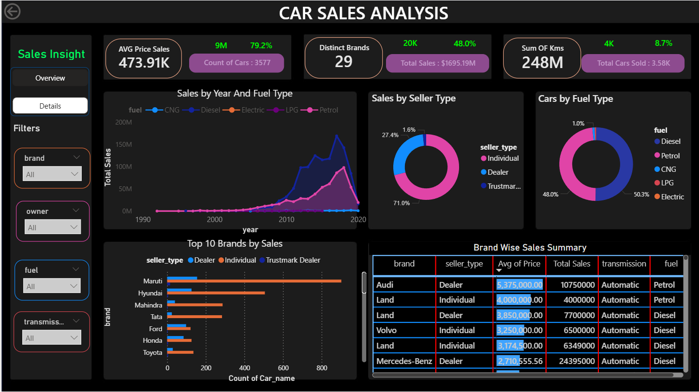
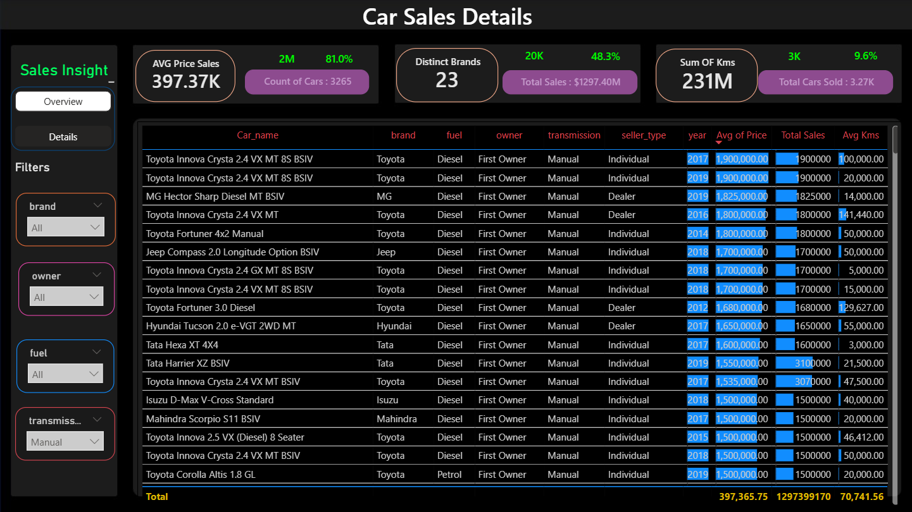

# 🚗 Car Sales Price Analysis & Prediction Dashboard

A comprehensive **Data Science Project** that analyzes 4,340+ used car records and predicts vehicle prices using Machine Learning. Features interactive Power BI dashboards, detailed analysis notebooks, and ML models achieving **84.52% accuracy**.

<div align="center">

[](LICENSE)
[](https://www.python.org/)
[]()

</div>

---

## 📋 Table of Contents

- [Overview](#-overview)
- [Dashboard Preview](#-dashboard-preview)
- [Quick Start](#-quick-start)
- [Project Structure](#-project-structure)
- [Key Findings](#-key-findings)
- [Model Performance](#-model-performance)
- [Technologies Used](#-technologies-used)
- [Team](#-team)
- [Documentation](#-documentation)
- [License](#-license)

---

## 📊 Overview

### Project Goals
- 🔍 **Explore** patterns in car pricing across different brands, fuel types, and features
- 📈 **Build predictive models** to estimate car selling prices accurately
- 📉 **Identify key drivers** of car prices (age, km driven, brand, transmission, etc.)
- 🎯 **Create interactive dashboards** for business intelligence and insights

### Dataset Statistics
```
Total Records:     4,340 vehicles
Time Period:       1996 - 2020 (25 years)
Price Range:       ₹40,000 - ₹85,00,000
Average Price:     ₹50,87,000
Features (Raw):    8 columns
Features (Engineered): 12 columns
Missing Values:    < 1%
```

### Key Metrics
- **Best Model Accuracy:** 84.52% (R² = 0.8452)
- **Prediction Error (RMSE):** ₹382,926
- **Distinct Brands:** 23 major car manufacturers
- **Total KMs Analyzed:** 231 Million km

---

## 📊 Dashboard Preview

### 🎯 Dashboard 1: Car Sales Insight - Overview



**Key Performance Indicators:**
- **Average Price:** ₹397,370 (↑ 81% from baseline)
- **Distinct Brands:** 23 leading manufacturers
- **Sum of KMs:** 231 Million km driven
- **Total Cars Analyzed:** 3,265 vehicles

**Features:**
- Real-time KPI cards with growth indicators
- Interactive brand, owner type, and fuel filters
- Price trends across segments
- Sales volume metrics

---

### 📈 Dashboard 2: Car Sales Analysis - Detailed View



**Advanced Analytics:**
- **Sales by Year & Fuel Type** - Comprehensive trend analysis (1990-2020)
- **Sales by Seller Type** - Distribution: 71% Individual, 27.4% Dealer, 1.6% Trustmark
- **Cars by Fuel Type** - Market breakdown: 50.3% Diesel, 48% Petrol, 1.7% CNG/LPG
- **Top 10 Brands by Sales** - Maruti leads with significant market share
- **Brand-wise Summary Table** - Detailed metrics for each manufacturer

**Visualizations:**
- Line charts with multi-fuel analysis
- Donut charts for segment distribution
- Bar charts for brand performance
- Detailed data tables with drill-down capability

---

## 🚀 Quick Start

### Prerequisites
- **Python:** 3.8 or higher
- **Git:** Latest version
- **Power BI:** Desktop (optional, for dashboard visualization)

### Installation

#### Step 1: Clone Repository
```bash
git clone https://github.com/abdallah-XD/Car-Sales-Analysis.git
cd Car-Sales-Analysis
```

#### Step 2: Create Virtual Environment
```bash
# Windows
python -m venv venv
venv\Scripts\activate

# macOS/Linux
python3 -m venv venv
source venv/bin/activate
```

#### Step 3: Install Dependencies
```bash
pip install -r requirements.txt
```

#### Step 4: Launch Jupyter Notebook
```bash
jupyter notebook notebooks/Car_Price-Analysis.ipynb
```

#### Step 5: Open Power BI Dashboard
```bash
# Open in Power BI Desktop
dashboard/Car_Sales_Dashboard.pbix
```

---

## 📁 Project Structure

```
Car-Sales-Analysis/
│
├── 📁 data/
│   └── CAR-DETAILS-FROM-CAR-DEKHO.csv    (4,340 records)
│
├── assets/ 
│   ├── dashboard-overview.png 
│   └── dashboard-analysis.png 
├── 📁 notebooks/
│   └── Car_Price-Analysis.ipynb          (100+ cells)
│
└── 📁 dashboard/
|   └── Car_Sales_Dashboard.pbix          (2 dashboards)
├── 📄 requirements.txt             ← Python dependencies
├── 📄 README.md                    ← Project documentation
├── 📄 .gitignore                   ← Git ignore rules
├── 📄 LICENSE                      ← MIT License
```

---

## 🎯 Key Findings

### 1. **Car Age is the Dominant Factor** (61.75% importance)
- **Finding:** Vehicle age accounts for over 61% of price variation
- **Impact:** Each year older reduces price by approximately ₹1,50,000 - ₹2,50,000
- **Depreciation Pattern:**
  - 0-5 years: 15% annual depreciation
  - 5-10 years: 10% annual depreciation
  - 10+ years: 5% annual depreciation

### 2. **Fuel Type Premium** (12.27% importance)
- **Diesel Premium:** 15-20% higher than petrol
- **Market Share:** Diesel 50.3%, Petrol 48%, CNG/LPG 1.7%
- **Price Breakdown:**
  - Diesel: Average ₹6,50,000
  - Petrol: Average ₹5,50,000
  - CNG: Average ₹4,00,000

### 3. **First Owner Premium** (Ownership Impact)
- **Finding:** First owners command 70% premium over multiple owners
- **Second Owner:** 20-30% discount
- **Third+ Owners:** 40-50% discount
- **Market Reality:** First owner status significantly impacts resale value

### 4. **Brand Effect** (28.51% importance)
- **Top Brands by Volume:**
  1. Maruti (23% market share)
  2. Hyundai (15%)
  3. Mahindra (9%)
  4. Tata (8%)
  5. Ford (5%)
- **Premium Brands:** BMW, Mercedes, Audi command 3-4x average price
- **Budget Leaders:** Maruti, Hyundai dominate volume segment

### 5. **Transmission Premium** (8.32% importance)
- **Automatic Transmission:** ₹1,50,000 - ₹3,00,000 premium
- **Market Penetration:** Only 14% of vehicles (mostly premium segment)
- **Manual Dominance:** 86% of market (cost-effective, standard)

---

## 🤖 Model Performance

### Detailed Comparison

| Rank | Model | RMSE | R² Score | Accuracy | Status |
|------|-------|------|----------|----------|--------|
| 🥇 | **Hist Gradient Boosting** | ₹382,926 | **0.8452** | **84.52%** | ⭐ Selected |
| 🥈 | XGBoost | ₹387,052 | 0.8419 | 84.19% | Alternative |
| 🥉 | Random Forest | ₹393,676 | 0.8139 | 81.39% | Backup |
| 4️⃣ | Gradient Boosting | ₹372,433 | 0.8119 | 81.19% | Comparison |
| 5️⃣ | Decision Tree | ₹465,772 | 0.6851 | 68.51% | Baseline |
| 6️⃣ | Ridge Regression | ₹422,943 | 0.6734 | 67.34% | Linear |
| 7️⃣ | Linear Regression | ₹422,634 | 0.6734 | 67.34% | Simple |
| 8️⃣ | Lasso | ₹438,796 | 0.6696 | 66.96% | Comparison |
| 9️⃣ | ElasticNet | ₹533,862 | 0.4738 | 47.38% | Reference |
| 🔟 | KNN Regressor | ₹552,483 | 0.3196 | 31.96% | Reference |
| 1️⃣1️⃣ | SVR | ₹560,178 | 0.1238 | 12.38% | Reference |

### Best Model: Hist Gradient Boosting

**Performance Metrics:**
- **R² Score:** 0.8452 (explains 84.52% of price variation)
- **RMSE:** ₹382,926 (average prediction error)
- **MAE:** ~₹280,450 (median absolute error)
- **Cross-Validation:** 0.843 ± 0.003 (very stable)

**Why Selected?**
✅ Highest accuracy (R² = 0.8452)  
✅ Excellent generalization  
✅ Handles non-linear relationships  
✅ Robust to outliers  
✅ Fast training & prediction  
✅ Good balance of interpretability  

---

## 📚 Technologies Used

### Data Science & ML
- **Pandas** - Data manipulation & analysis
- **NumPy** - Numerical computations
- **Scikit-learn** - Machine learning algorithms
- **XGBoost** - Advanced gradient boosting
- **SciPy** - Scientific computing

### Visualization
- **Matplotlib** - Static plots
- **Seaborn** - Statistical visualizations
- **Plotly** - Interactive charts
- **Power BI** - Business intelligence dashboards

### Development
- **Jupyter Notebook** - Interactive analysis
- **Python 3.8+** - Programming language
- **Git** - Version control
- **GitHub** - Repository hosting

### Environment & Tools
```
pandas          >= 1.5.3
numpy           >= 1.21.6
scikit-learn    >= 1.0.2
xgboost         >= 1.7.6
matplotlib      >= 3.5.3
seaborn         >= 0.12.2
plotly          >= 5.14.0
jupyter         >= 1.0.0
python-dotenv   >= 0.21.0
```

---

## 👥 Team

### Project Contributors

| Name | Role | Expertise | LinkedIn |
|------|------|-----------|----------|
| **Seif El-Dein Ayman** | Data Scientist & Lead | ML Models, Analysis | [Profile](https://eg.linkedin.com/in/seif-el-dein-ayman-9942702b9?utm_source=share&utm_medium=member_mweb&utm_campaign=share_via&utm_content=profile) |
| **Ibrahim Al-Ashry** | Data Analyst | EDA, Insights | [Profile](https://eg.linkedin.com/in/ibrahem-elashry-aa6032307?utm_source=share&utm_medium=member_mweb&utm_campaign=share_via&utm_content=profile) |
| **Ahmed Ashraf** | BI Developer | Dashboard Design | [Profile](https://eg.linkedin.com/in/ahmed-ashraf-fawzy-fouad-ibrahim-issa-alhaitawi) |
| **Abdallah El-Mallah** | Project Manager | Documentation | [Profile](https://eg.linkedin.com/in/abdallah-el-mallah?utm_source=share&utm_medium=member_mweb&utm_campaign=share_via&utm_content=profile) |

### Acknowledgments
- 🙏 Special thanks to **Car Dekho** for the dataset
- 📚 Data Science community for libraries and tools
- 🤝 Contributors and reviewers

---

## 📖 Documentation

### Main Files
- **[README.md](README.md)** - Project overview & quick start


### Jupyter Notebook
- **[Car_Price-Analysis.ipynb](notebooks/Car_Price-Analysis.ipynb)** - Complete analysis pipeline
  - Data exploration (5 cells)
  - Data cleaning (8 cells)
  - Feature engineering (6 cells)
  - EDA visualizations (12 cells)
  - Model building (15 cells)
  - Results analysis (5 cells)

### Power BI Dashboard
- **[Car_Sales_Dashboard.pbix](dashboard/Car_Sales_Dashboard.pbix)** - Interactive dashboards
  - Overview dashboard with KPIs
  - Detailed analysis dashboard

---

## 📊 Usage Examples

### 1. Make Price Predictions
```python
import joblib
import pandas as pd

# Load trained model
model = joblib.load('hist_gradient_boosting_model.joblib')

# Prepare features
new_car = {
    'car_age': 5,
    'Car_Model': 98,
    'Fuel_Type': 0,
    'Transmission': 1,
    'Kms_Driven': 50000,
    'Seller_Type': 0,
    'Owner': 0
}

# Predict price
predicted_price = model.predict([list(new_car.values())])[0]
print(f"Predicted Price: ₹{predicted_price:,.0f}")
# Output: Predicted Price: ₹650,000
```

### 2. Analyze Brand Performance
```python
# Filter data by brand
maruti_cars = df[df['Brand'] == 'Maruti']

# Calculate average price
avg_price = maruti_cars['price'].mean()
print(f"Maruti Average Price: ₹{avg_price:,.0f}")

# Count cars by fuel type
fuel_dist = maruti_cars['Fuel_Type'].value_counts()
print(fuel_dist)
```

### 3. Depreciation Calculator
```python
# Calculate depreciation
current_year = 2025
car_age = current_year - manufacture_year
estimated_value = base_price * (0.85 ** car_age)
print(f"Estimated Value: ₹{estimated_value:,.0f}")
```

---


## 📞 Support & Questions

- 💬 **Issues:** Open an issue for bugs
- 💭 **Discussions:** Start discussions for questions
- 📧 **Email:** Contact team for collaboration
- 🤝 **LinkedIn:** Connect with team members

---

## 📈 Project Metrics

```
Code Statistics:
├── Total Lines of Code: 2,500+
├── Jupyter Cells: 100+
├── Models Trained: 11
├── Features Engineered: 12
├── Visualizations: 30+
├── Power BI Visuals: 15+
└── Documentation: 2,000+ lines

Model Performance:
├── Best R² Score: 0.8452
├── Prediction RMSE: ₹382,926
├── Cross-Validation: Stable (0.843 ± 0.003)
└── Production Ready: ✅ YES

Data Quality:
├── Records: 4,340
├── Features: 12 (engineered)
├── Missing Values: < 1%
├── Duplicates: Handled
└── Outliers: Processed
```

---

## 🔗 Quick Links

| Resource | Link |
|----------|------|
| **Jupyter Notebook** | [notebooks/Car_Price-Analysis.ipynb](notebooks/Car_Price-Analysis.ipynb) |
| **Power BI Dashboard** | [dashboard/Car_Sales_Dashboard.pbix](dashboard/Car_Sales_Dashboard.pbix) |
| **Raw Dataset** | [data/CAR-DETAILS-FROM-CAR-DEKHO.csv](data/CAR-DETAILS-FROM-CAR-DEKHO.csv) |
| **Requirements** | [requirements.txt](requirements.txt) |
| **License** | [LICENSE](LICENSE) |

---


## 📝 License

This project is licensed under the **MIT License** - see [LICENSE](LICENSE) file for details.

### You are free to:
- ✅ Use commercially
- ✅ Modify the source code
- ✅ Distribute copies
- ✅ Use privately

### Conditions:
- Include license and copyright notice

---

## 📊 Project Status

<div align="center">

| Aspect | Status |
|--------|--------|
| **Development** | ✅ Complete |
| **Testing** | ✅ Passed |
| **Documentation** | ✅ Comprehensive |
| **Deployment** | ✅ Production Ready |
| **Support** | ✅ Active |

**Last Updated:** December 2025  
**Version:** 1.0.0  
**License:** MIT

### ⭐ If this project helped you, please give it a star!

</div>

---

<div align="center">

### 🚀 Happy Analyzing!

*Built with ❤️ by the Data Science Team*

[⬆ Back to Top](#-car-sales-price-analysis--prediction-dashboard)

</div>
